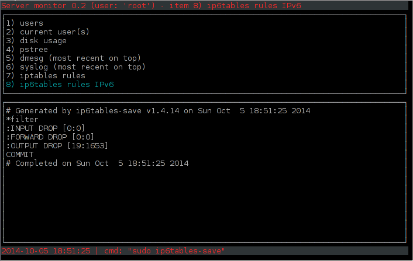

pyservmonitor
=============

simple python wrapper around sysadmin unix scripts with a ncurses interface

the different entries in the interface are easily editable (in [config.ini](config.ini))

examples/pyservmonitor.png

